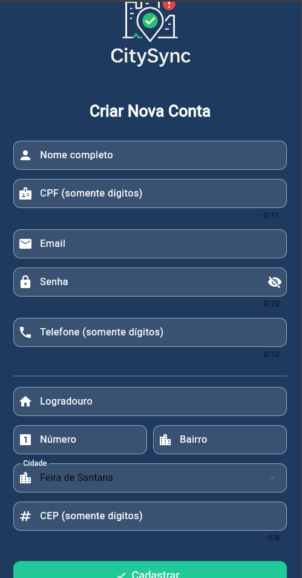
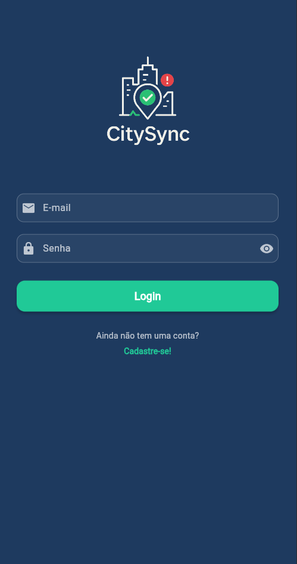
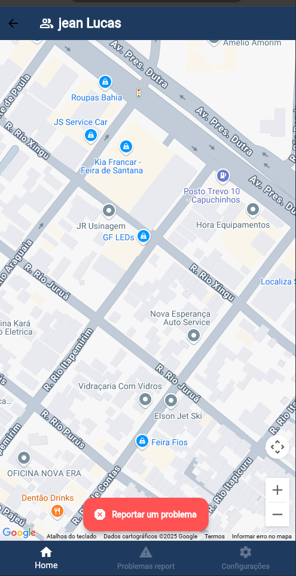
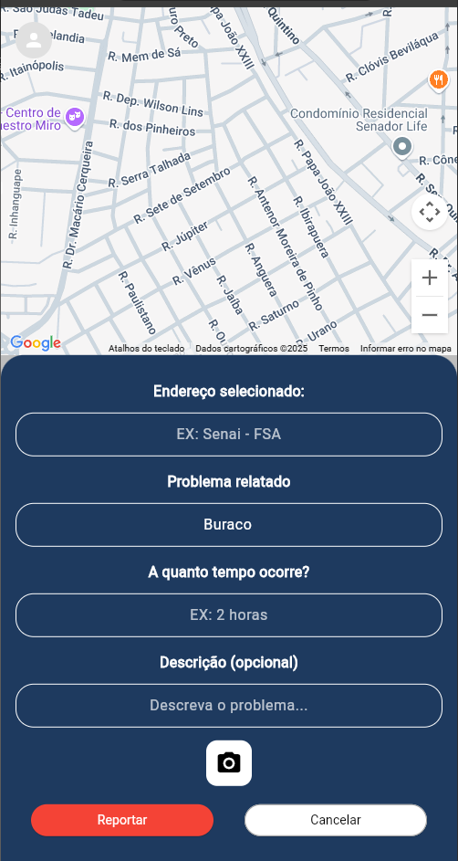
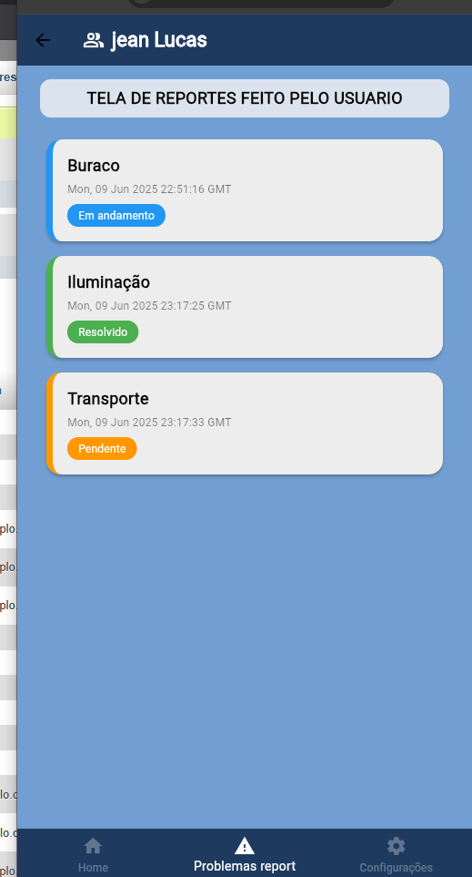
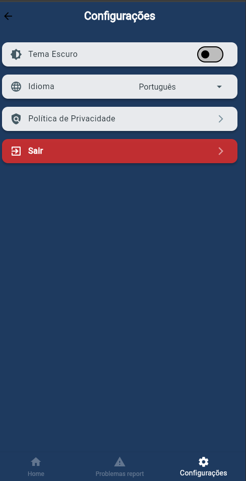

# 🌆 CitySync

**CitySync** é uma aplicação colaborativa voltada para a melhoria da infraestrutura urbana nas cidades. O app conecta cidadãos, gestores públicos e equipes responsáveis pela manutenção urbana, permitindo que problemas como buracos, iluminação pública queimada, lixo acumulado sejam reportados, monitorados e resolvidos de forma ágil e transparente.

# Como funciona
Usuários cadastram reportes detalhando o problema encontrado na cidade, com descrição, categoria e localização automática via GPS. É possível anexar fotos para melhor contextualização. Esses reportes ficam disponíveis para visualização e acompanhamento tanto pelo cidadão que enviou quanto pelos gestores públicos responsáveis, que podem atualizar o status do problema (pendente, em andamento ou resolvido). O app também pode enviar notificações para informar sobre atualizações no andamento do reporte.

## 🧱 Tecnologias utilizadas

- **Frontend**: Flutter
- **Backend**: Python com Flask
- **Banco de dados**: SupaBase
- **APIs externas**: Google Maps API para geolocalização

## 🖼️ Capturas de tela

| Tela de cadastro           | Tela de login              | Tela principal (mapa)       |
|---------------------------|----------------------------|-----------------------------|
|  |  |  |

| Tela de report de problemas | Tela listagem de problemas | Tela configurações         |
|-----------------------------|----------------------------|----------------------------|
|  |  |  |

